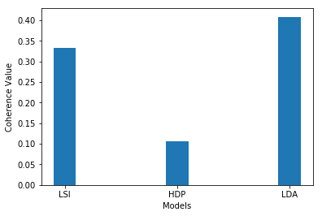

# Topic-Classifier

Topic Classifier on Ubuntu tech support Logs

# Requirements
1. gensim
2. pattern
3. nltk
4. pprint
5. matplotlib
6. sklearn
7. csv
8. glob

# Run
1. Download data from [here](http://dataset.cs.mcgill.ca/ubuntu-corpus-1.0/ubuntu_dialogs.tgz) and unzip into ``dialogs/`` in working directory
2.  `jupyter notebook Topic_Modelling.ipynb` to open the Jupyter notebook

# Model
A comparison between LSI, HDP and LDA models using coherence to investigate the coprus of Ubuntu logs, and the predictions using the best model on test set

# TODO
- [ ] Faster Pre-processing to include custom lemmatize operations
